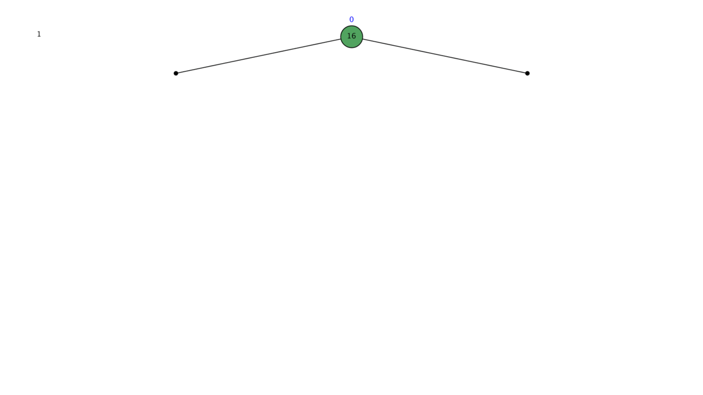

# AVL-Tree implementation
## Animation of working tree
Adding the array
```
int[] num = new int[] {16,10,2,4,26,13,15,1,7,6,5};
```
and removing the array
```
int[] rem = new int[] {1, 6, 13, 10};
```

| Thing | Description |
| ------------- |:-------------:| 
| Green Dot with number | Node with value| 
| Black Dot | Ending   | 
| Blue number | Balance value of Node |



## Usage

```
BinaryTree tree;

void setup() {
    ...
    tree = new BinaryTree();
    ...
}

void draw(){
    ...
    tree.insert(IDataItem data); //insert into tree
    ...
    tree.remove(IDataItem data); //remove from tree
    ...
    tree.count(); //get amount of Nodes
    ...
    tree.draw(); //draw the tree as seen above
    ...
}

```

## Construction
### Interfaces
There are two main interfaces in this code:
 - IDataItem
 - ITreeItem
Their use is explained in the following

#### IDataItem:
This is used for storing data in the Nodes. It contains a key and a compare Function.

#### ITreeItem:
This is used for making Nodes and Endings which are the core structure of the Tree

### Classes:
There are a few main classes in this code:
 - BinaryTree
 - Node
 - Ending
 - Number
Their use is explained in the following

#### BinaryTree:
Head class for Binary tree holding the root Node and passing through.

#### Node:
Controlling the balancing, measuring height, controlling insert and remove.
Implementing ITreeItem.

#### Ending:
Stopping the amount of nullchecks.
Implementing ITreeItem.

#### Number:
Holder for a number.
Implementing IDataItem.

## Information
 - [Wikipedia (de)](https://de.wikipedia.org/wiki/AVL-Baum)
 - [Wikipedia (en)](https://en.wikipedia.org/wiki/AVL_tree)
